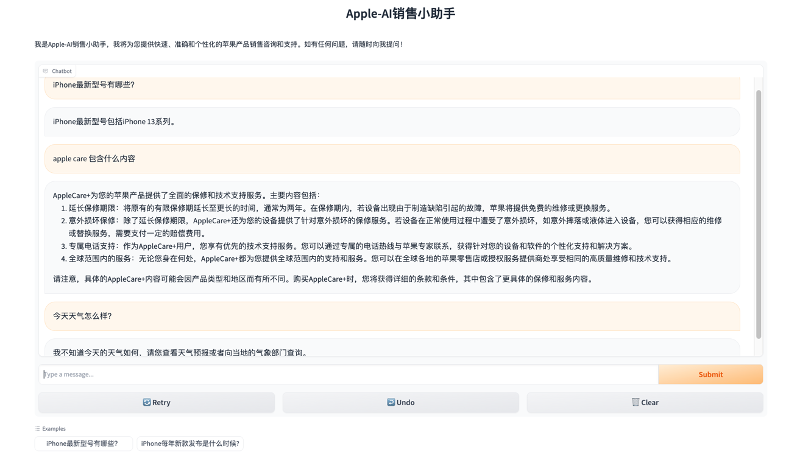
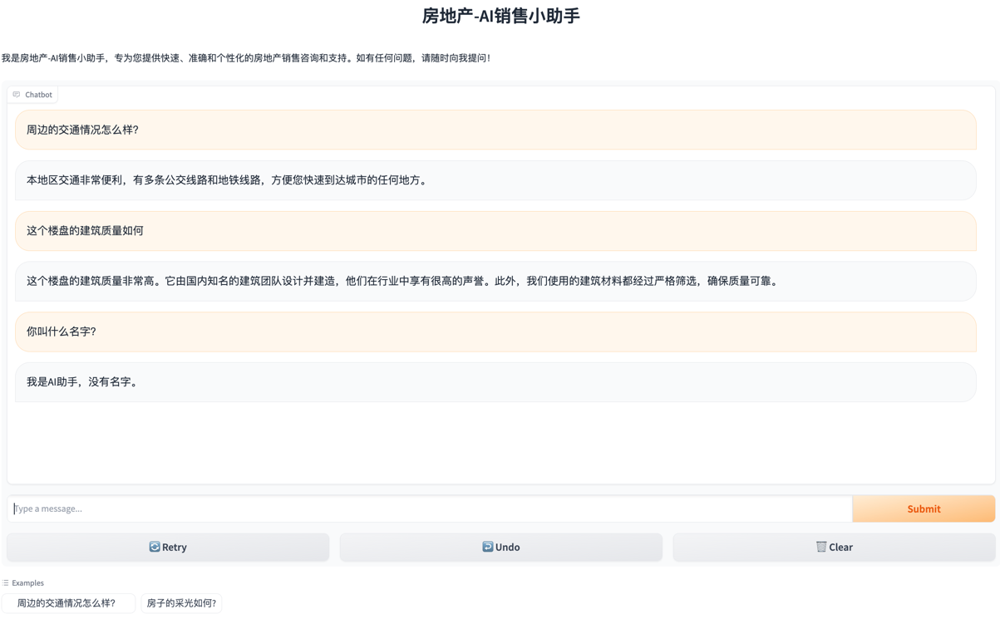

## 进阶篇：基于知识库的房产销售 Sales-Consultant

### 第一部分：项目简介

- [Sales-Consultant 业务流程与价值分析](../resource/Sales-Consultant 业务流程与价值分析.png)
- Sales-Consultant [技术方案](../resource/基于知识库问答的典型用例.png)
  与[架构设计](../resource/Sales-Consultant 技术方案与架构设计.png)
    - 使用 GPT-4 生成[销售话术](../resource/销售话术.png)
    - [使用 FAISS 向量数据库存储销售问答话术](../resource/使用 FAISS 向量数据库存储销售问答话术.png)
    - 使用 RetrievalQA
      检索销售话术数据，[Top_k](../resource/使用 RetrievalQA 检索销售话术数据_topk.png)，[similarity](../resource/使用 RetrievalQA 检索销售话术数据_similarity.png)
    - [使用 Gradio 实现聊天机器人的图形化界面](../resource/使用 Gradio 实现聊天机器人的图形化界面.png)
- [实战 LangChain 版 Sales-Consultant](../project/langchain_sales_chatbot)

    - [Apple-AI销售小助手](../resource/Apple-AI销售小助手.png)
    
    - [房地产-AI销售小助手](../resource/房地产-AI销售小助手.png)
  