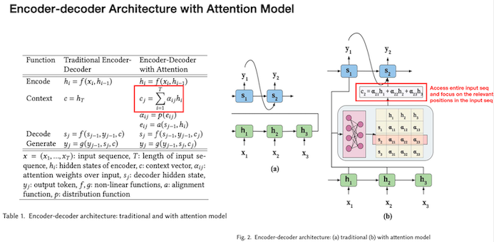
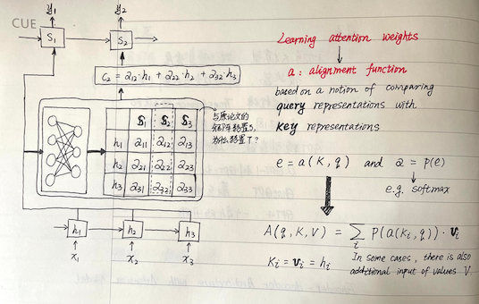

## 基础篇：大模型基础--理论与技术的演进（第二节课）
### 第一部分：课后习题
<hr />

#### 单选题：
```text
GPT-1 在哪些方面相较于传统的语言模型取得了突破？
A. 引入了深度学习框架
B. 利用生成式预训练改善语言理解
C. 实现了图像识别的功能
D. 增加了自我监督学习的机制
答：B

对于 ChatGPT 来说，其主要的优势是什么？
A. 高性能的图像识别
B. 自然且连贯的对话生成
C. 精确的数学运算
D. 音乐创作能力
答：B

GPT-4 相比于 GPT-3.5 主要的技术进步是？
A. 提升了模型的大小
B. 增加了对话能力
C. 引入了图像识别能力
D. 加强了音乐创作能力
答：C

以下哪项技术是与"Chain-of-Thought"最相关的？
A. 一元语法分析
B. 多路径推理
C. 自洽性分析
D. 情感分析
答：C ❌（正确答案：B）

“Tree-of-Thoughts” 的主要作用是？
A. 实现多轮对话
B. 提升语义理解
C. 提供多路径推理
D. 改善模型对话的连贯性
答：B ❌（正确答案：D）

GPT-1 的主要研究目标是？
A. 多语言模型训练
B. 通过生成式预训练改善语言理解
C. 实现机器自主创作
D. 多媒体信息处理
答：B

在 GPT-2 中，"模型是无监督多任务学习者"的概念是如何实现的？
A. 通过对话管理
B. 通过多任务联合训练
C. 通过生成式预训练和特定任务微调
D. 通过强化学习训练
答：C

GPT-3 的主要特点是？
A. 用极少的样本就可以实现学习
B. 实现了自主创作
C. 优化了对话管理能力
D. 引入了情感分析功能
答：C ❌ （正确答案：A）

GPT-4 的训练中，使用了什么新的技术？
A. 情感分析
B. 图像识别
C. 混合专家系统
D. 生成对抗网络
答：B ❌ （正确答案：C）

"Self-Consistency: Multi-path Reasoning"的主要目标是？
A. 提升模型的情感理解能力
B. 提升模型对话的连贯性
C. 通过多路径推理，增强模型的自洽性
D. 提升模型的创作能力
答：A ❌ （正确答案：C）
```
#### 多选题
```text
下列哪些选项是描述 GPT-1 的特点？
A. 利用生成式预训练提升语言理解能力
B. 实现了机器自主创作
C. 可以进行多语言模型训练
D. 引入了情感分析功能
答：A
在处理对话任务时，ChatGPT 具有哪些优势？
A. 高性能的图像识别
B. 自然且连贯的对话生成
C. 精确的数学运算
D. 音乐创作能力
答：B
"Chain-of-Thought"与以下哪些概念相关？
A. 一元语法分析
B. 多路径推理
C. 自洽性分析
D. 情感分析
答：B、C
在 GPT-3 的研究中，哪些是其主要特点？
A. 用极少的样本就可以实现学习
B. 实现了机器自主创作
C. 优化了对话管理能力
D. 引入了情感分析功能
答：C ❌ （正确答案：A）
在 GPT-4 的开发中，哪些新的技术被采用？
A. 混合专家系统
B. 生成对抗网络
C. 情感分析
D. 图像识别
答：C、D ❌ （正确答案：A）
```

### 第二部分：相关名词解释
<hr />

##### 1、什么是In-context learning？
```text
In-context learning（上下文学习）是指在处理信息、学习或决策时，考虑到当前情境或背景的方法。它强调将当前信息与先前的知识和环境相结合，以获得更全面和准确的理解或决策。
例如，当你在学习新的单词时，将它们放入句子中以及使用它们，有助于更好地理解它们的含义和用法。这种学习方式强调将知识放入实际情境中，从而更好地理解和记忆。
在例如：多轮对话中的记忆上下文可以被看作是 "in context-learning" 的一种表现。
```

##### 2、Prompt Turing(即：Prompt Enginner) vs Prompt learning vs In-context Learning
```text
Prompt Learning是一种使用预训练语言模型的方法，它不会修改模型的权重。关注的是如何通过设计 `有效的提示` 来 `引导` 模型的输出。
In-context Learning是一种使用预训练语言模型的方法，它不会修改模型的权重。关注的是如何 `利用` 输入序列中的 `上下文信息` 来影响模型的输出。

prompt learning更关注于如何 `训练` 模型以响应特定的提示；
prompt tuning则更关注于如何 `找到最优的提示` 以提高模型的性能。
```
<br />

##### 3."Prompt tuning" 是一种调整输入提示（prompt）的方法，以指导大语言模型生成更准确、合理和有用的回答。以下是一些常见的 "prompt tuning" 方法
```text
Pattern-based Prompts：使用特定的模式或结构化的提示来引导模型生成回答。例如，使用 "What is" 或 "Explain" 这样的模式来获取解释性的回答。

Cloze-style Prompts：使用不完整的句子或段落，缺少关键信息，让模型填补缺失部分。例如，"The capital of France is ___." 可以引导模型填写空缺。

Generative Prompts：提供一个开放式的提示，要求模型自由生成相关的回答。例如，"Tell me about" 后面可以是任何话题。

Adversarial Prompts：引入对抗性元素，让模型在不受到敌对输入的干扰下生成鲁棒的回答。

Rewrite Prompts：对初始提示进行重写或改写，以使其更清晰、精确或特定。

Explanation-based Prompts：要求模型不仅给出回答，还要解释其回答的原因或过程。

Comparison Prompts：要求模型比较两个或多个概念、选项等，并给出有关它们的回答。

Scenario-based Prompts：在特定场景下设置提示，以促使模型生成在该场景中有意义的回答。

Socratic Prompts：通过连续提问，引导模型逐步生成更深入的回答，类似于哲学上的苏格拉底式讨论。

```
<br/>

##### 4、Zero-shot, One-shot, Few-shot 是什么？他们与prompt tuning的关系是什么？【目前还不清楚他们具体的关系等后期慢慢解答】
```text
Zero-shot 、One-shot 、Few-shot Learning策略主要是用于解决神经网络模型因为训练数据少，导致模型泛化能力差的问题。
Zero-shot 是在没有接受任何示例训练的情况下，通过适当的提示来进行任务。这需要模型具备广泛的泛化能力，能够从提示中理解任务的要求并生成合适的回答。
One-shot 是在接受仅一个示例训练的情况下，通过提示来进行任务。尽管只有一个示例，但模型试图从这个示例中学到足够的信息，以在新情境中进行泛化。
Few-shot 是在接受少量示例训练的情况下，通过提示来进行任务。这种方法允许模型在少量示例上进行训练，从而在新的情境中产生更好的结果。
```
<br/>

##### 5、三种常用的prompt tuning的方法：Chain of Thought（思维链） and Self-Consistency（自洽性）and Tree of Thoughts（思维树）
```text
Chain of Thought（CoT）：下面例子中，使用逐步扩展的方式呈现"Chain of Thought"，每一步回答都基于前一步的回答，逐步构建了关于"XXXX"的思维链。这种逐步展开的方式可以更清晰地向用户解释一个复杂问题的多个方面。
    举例：User: "为什么要保持身体健康？"
        Model: "保持身体健康对于个人的各个方面都非常重要。"
        Model: "首先，身体健康可以提高生活质量。"
        Model: "这意味着你能够更好地享受生活，从事你喜欢的活动，而不会受到体力上的限制。"
        Model: "此外，保持身体健康还有助于预防疾病。"
        Model: "通过均衡的饮食和适度的运动，你可以降低患上许多慢性疾病的风险，如心脏病和糖尿病。"
        Model: "另外，身体健康也与心理健康紧密相关。"
        Model: "运动可以释放身体内的化学物质，有助于减轻压力和焦虑，提升情绪状态。"
        Model: "最后，保持身体健康可以增强免疫系统。"
        Model: "一个强健的免疫系统能够更好地应对疾病和感染，使你的身体更有抵抗力。"
    经典的提示词：Let‘s think step by step！
    
self-consistency（s-c）：确保了模型的回答在逻辑上是合理和可靠的。
    举例：User: "狗的寿命通常有多长？"
         Model: "狗的寿命通常因狗的品种和大小而异。较小的狗品种，如吉娃娃，通常寿命更长，可以活到12-20岁。而大型犬，如圣伯纳德，寿命可能较短，大约8-10岁。"
    在这个回答中，大语言模型展示了自洽性，它在内部逻辑上保持一致。模型首先指出寿命与狗的品种和大小有关，然后在具体的品种范围内提供了寿命范围。这种逻辑一致性使得回答更加可信，读者不会在回答中找到矛盾之处。
         
Tree of Thoughts（ToT）：表现为模型在回答问题时按照层次结构组织信息，从整体到细节展开，呈现出一种层次性的结构。
    举例：User: "手机的重要性是什么？"
         Model: "手机在现代社会中具有重要的地位。从整体来看，手机在以下几个方面具有重要性：通信、信息获取和社交。在通信方面，手机是人们日常交流的重要工具，通过电话、短信和社交媒体，人们可以随时保持联系。信息获取是另一个重要方面，手机让我们能够在任何时候获取新闻、知识和娱乐内容。此外，手机也在社交方面发挥着作用，通过社交应用，人们可以与朋友、家人保持联系，甚至结识新的朋友。总之，手机在多个层面上都具有重要的作用，成为了人们生活中不可或缺的一部分。"
    在这个回答中，大语言模型使用了"Tree of Thoughts"的结构，从整体重要性开始，逐步展开到通信、信息获取和社交这三个子主题。每个子主题又分别进一步解释和展开。这种层次性的组织方式帮助读者更清楚地理解回答，从整体到细节逐步展示信息，让回答更具有结构性和连贯性。    
    扩充：在ToT框架内，可以根据树结构插入和使用不同的搜索算法。作者探索了两种相对简单的搜索算法，并将更高级的算法(例如AlphaGo(AlphaZero) 蒙特卡洛树搜索（MCTS）)留给未来的工作，TOT-BFS广度优先算法、深度优先搜索(ToT-DFS)）

总之，"Chain of Thought"是思维按照线性顺序连接的方式，"Self-Consistency"是思想和回答内部保持逻辑一致性，而"Tree of Thoughts"是将思维层次化地组织成树状结构。
ToT包含SC，SC包含CoT

```
  

### 第三部分：一些问答

##### 1、SFT fine-tuning、fine-turning 和 Instruction-Tuning的区别？
```text
答：Fine-tuning：微调
SFT(Supervised Fine-Tuning)：有监督的微调
Instruction-Tuning：指令微调
1.Fine-tuning: 这是一种通用的深度学习训练策略，通常在预训练模型基础上进行，以适应新任务。通过对预训练模型的参数进行微调，使模型能够在特定任务上表现更好。
2.SFT: 这是一个监督学习过程，即通过人工标注的训练数据集来调整模型的参数。在这个过程中，模型学习将输入映射到预期的输出。SFT就是一种Fine-tuning的策路。
3.Instruction-Tuning: 是OpenAI提出的一种新的训练方法。通过向模型提供人类编写的指导性指令，对模型进行训练和调整。主要用于增强模型对特定指令的响应。
这些指令可以是对输入输出的期望行为描述，如"重要性：高；可读性：中；重要性：低"，从而控制模型在生成文本时更好地满足用户需求。使模型能够正确理解并生成预期的输出。

Prompt和Instruction都是用于指导模型生成输出的文本，不对模型的权重进行修改； fine tunning会对模型的权重进行修改。 Prompt和Instruction比较相似，关注的目标不一样。
```
<br />

##### 2、我要用大模型做分类，我用openai的finetune，效果很好，6w条语料4轮epoch可以到0.94accuracy。但是高质量的语料标注是个难活。我朋友告诉我，prompt-tuning用的语料更少，而语料治疗要求没那么高，而效果更好。
```text
文本分类是一个经典下游任务，如果你的预料本身并没有给使用的OpenAI基础模型增加额外的知识，那么prompt-tuning确实是更有性价比的
关于prompt-based learning目的是让大家理解如何从 standard prompt 演进到适用性极高的 ToT 的。
```
<br />

##### 3、思维链，是指提示词提问时的思维链，还是模型回答问题时运用思维链来回答？我的理解是后者，因为昨天的后半程课，全程讲的是模型在回答问题时的思维链逻辑推理，但是助教直播间说的是提示词提问时用思维链方式。能捋一捋吗？昨天并没有讲什么样的提示词规则更高效

```text
对于一个模型在回答问题时的思维链逻辑推理，可以将其理解为模型对输入问题进行处理和分析的过程。这个过程可以看作是一种思维链，其中模型通过触发不同的关联或推理机制来生成答案。
当使用提示词提问时，思维链方式可以指引你以一种递进的思考方式来构建问题。你可以从一个提示词出发，将其作为起点，然后依次深入探索相关的概念、关联或细节，构建一个连贯的问题链条。每个问题都基于前一个问题的答案或信息，从而逐步扩展和深化对问题的理解。
通过思维链方式提问可以帮助你更系统地探索和获取信息，从而得到更准确、全面的回答。这种方法可以用于讨论复杂的主题、解决问题或促进深入思考和探索。
```
<br />

##### 4、请教一个小小问题 我看观看视频时 发现如图中的关于Encoder-decoder Architecture的公式和图示 虽然是引自原论文 但我认为高亮部分的公式和Sample是有差异的： 
1. 公式中：hi是encoder的hidden state, cj是context vector为了计算出decoder的hidden state（有点类似hi是输入cj是输出）, 所以attention weights即aij的角标关系是先i后j, 即先hi输入后cj输出 
2. 但Sample公式中：c2 = a21·h1 + a22·h2 + a23·h3 其attention weights即aij的角标关系是先j 后i, 其实与公式正好相反, 我觉得这个Sample的算式表达是有问题的


    

```text
答：要理解这个问题呢，有几个关键第一个就是这个角标你提的很好，l和J在这个表格里面呢，其实我们能看到1呢，其实是指输入我们的encounter编码器的隐藏状态。Hi这个1表示的是输入的一个特定位置，J是输出，就是我们的这个 dcoder，我们的解码器想要去定位的那个位置，就那个特定的词，所以I通常指的是我们图当中的们的比如说 S2Y2 这样的一个输出这个是没问题的，然后在表格里面呢，其实我们能看到它的逻辑是顺畅的，就是我们用 CJ。就是表达我们输出的地接一个隐藏层的状态它是由这个矩阵乘上每一个输入乘出来的的和。
至于在那个图例里面，为什么感觉好像它的角标倒过来了啊，我的理解啊，个人的理解，作者这里呢更多的是想通过这个图例来表达含义。但是在这里呢，其实就。某种层面上把这个阿尔法这个矩阵，他做了一个转制啊，做这个转制也是为了这个图做的更好看，因为你看这个图中呢，其实中间那一部分是一个神经网络，然后这个神经网络的输出呢，是一个S。然后呢，它的这个每一每一行是一个 S，每一列呢，上面又变成了一个H，这个顺序呢，就跟我们其实正常认为的应该输入是H，输出是 S，有点倒过来了，所以它是为了这个图例的表达方便。我理解在图例当中，把这个阿尔法矩阵做了一个转制，对就相当于它的行和列做了一次交换
但就理解公式而言，你从表格来看是没有问题的，就表格可能会更明确一点，不管是S还是 C，其实都表达的是解码层的一个特定位置的隐藏成状态，或者它对应的上下文向量，那么对应的这个位置这个J就比如说我们这里看到的 S2 或者C2，都是说锚定了一个输出的位置，然后把这个。腾讯 which，就是我们的注意力权重和对应的输入的这个hi去做相乘，然后再做这个西格玛，就是把它求和，这个逻辑是没问题的。核心就是这里我理解是为了图的表达形式上更直观，做了一次转制的一个展示啊，这我个人的理解。

回复：好的 明白了 非常感谢彭老师的细致解答 我一开始也是感觉把矩阵转置了 但没明白为什么要转置 你说NN剪头对应输出所以横向是输出S 这么说的话确实有道理 我还特意重画了一下 
```

<br />

##### 5、有监督学习和无监督学习，远程监督是啥意思
```text
答：有监督，就是你需要标注信息，在给机器学习。 无监督就是你直接可以给，不需要进行标注。 
远程监督是一种半监督学习方法，它的基本思想是利用已有的知识库自动生成标注数据。在远程监督中，模型会利用知识库中的实体和关系信息，自动标注相关的文本数据，
然后使用这些标注数据训练模型。相对于有监督学习，远程监督可以减少标注数据的工作量，但标注数据的质量受到知识库的影响。
```
<br />

##### 6、GPT-4相较GPT-3、GPT-3.5的优势
```text
答：
    1. 多模态模型: GPT-4支持图像输入，出色的视觉信息理解能力使得GPT-4能对接更多样化的下游任务， 
        如:描述不寻常图像中的幽默、总结截屏文本以及回答包含图表的试题。在文本理解能力上，GPT-4 在中 文和多轮对话中也表现出远超 GPT-3.5 的能力。
    2. 扩展上下文窗口:gpt-4 and gpt-4-32k 分别提供了最大长度为8192和32768个token的上下文窗口。
        这使得 GPT-4可以通过更多的上下文来完成更复杂的任务，也为 思维链(CoT)、思维树(ToT)等后续工作提供 了可能。
    3. GPT+生态 :借助GPT-4强大能力，依托 ChatGPT Plugin 搭建AIGC应用生态商店(类似 App Store)
    4. 应用+GPT :GPT-4已经被应用在多个领域，包括微软Office、Duolingo、Khan Academy等。
```
<br />


##### 7、如何使用BERT进行文本分类
```text
- 数据准备：首先，准备你的文本分类数据集。数据集应包含标记好的文本样本和对应的类别标签。确保你有足够的数据用于训练、验证和测试。

- BERT模型选择：选择适合你任务的BERT模型。BERT有不同的变体和大小，如BERT-Base、BERT-Large等。较大的模型通常有更多的参数和更强的表示能力，但训练和推理的速度也更慢。

- 数据预处理：对文本数据进行预处理，使其适应BERT模型的输入格式。首先，将文本切分成词（Word Piece Tokenization），并将每个词转换为对应的词ID。然后，添加特殊标记（如"[CLS]"和"[SEP]"）以表示句子的开始和结束。如果需要，还可以进行填充和截断操作，以保证输入序列的长度一致。

- 模型搭建：根据选择的BERT模型，在代码中构建相应的模型结构。可以使用开源的深度学习框架（如TensorFlow、PyTorch）提供的BERT模型实现，或者使用预训练的BERT权重进行加载。

- 模型训练：使用准备好的数据集对BERT模型进行训练。在训练过程中，使用适当的优化器（如Adam）和损失函数（如交叉熵损失函数）进行参数更新。根据需要，可以使用验证集进行模型的调优和超参数选择。

- 模型评估：在训练完成后，使用测试集评估模型的性能。计算分类准确率、精确率、召回率、F1值等指标来评估模型的表现。

- 推理预测：使用训练好的BERT模型进行推理预测。将待分类的文本转换为BERT模型的输入格式，并通过模型的前向传播获取分类结果。

注意：模型训练 <> 预训练。模型训练是指在预训练的基础上进行的微调训练，而不是指BERT的初始预训练过程
```


##### 8、实际案例：A使用 bert 做文本分类，然后每个epoch的loss不是一直下降的，accuracy也不是一直上升的。目前样本量级只有几十条。
```text
解决问题的思路可以关注以下2点。
1. 数据工程，需要关注样本量级，是否平衡，特征选择和清洗等预处理
2. 模型工程，需要关注参数是否是最佳值，例如 lr, rc, batch_size...，还有可能关注下BERT是否已经达到天花板，是否需要更大的模型
也可以换另外一种做法，把样本扔到嵌入模型取最终向量，在去训练一个分类器，这样更加的快速

现在看起来是欠拟合，你可以尝试加多数据量来解决。这点数据量模型都跑不起来的，用嵌入模型的结果在去sklearn做个简单的分类器（这个步骤是：下游任务的分类训练），就可以得到一个比较好的结果了
总结：目前这个案例中是在模型微调训练阶段的数据集太少了
```


小点：相同也可以换站点，换了站点一般ip就换了。关闭chrome, 换站点, 换完后电脑重启一下，我遇到后大部分是这三步同时进行，印象中是100%解决。
