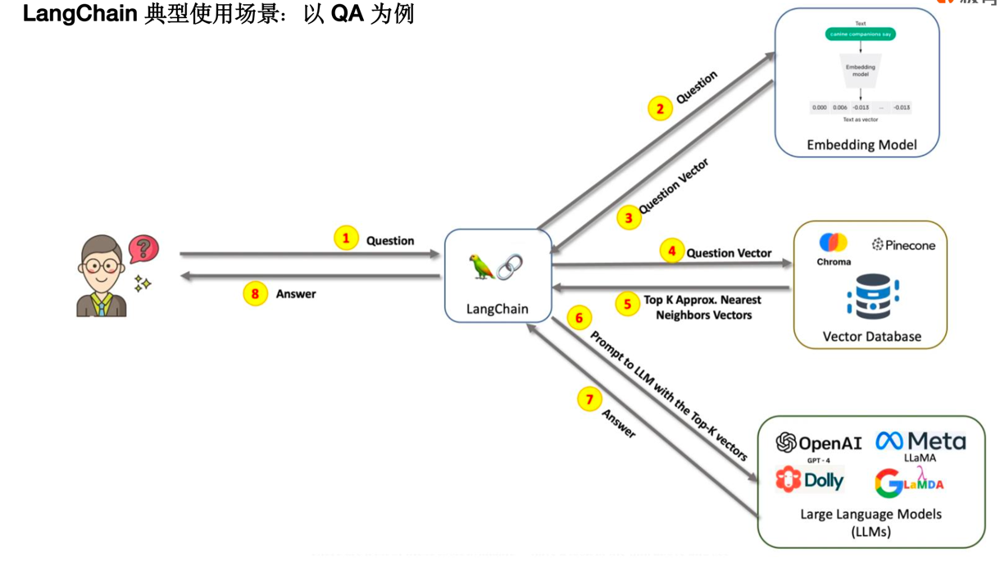
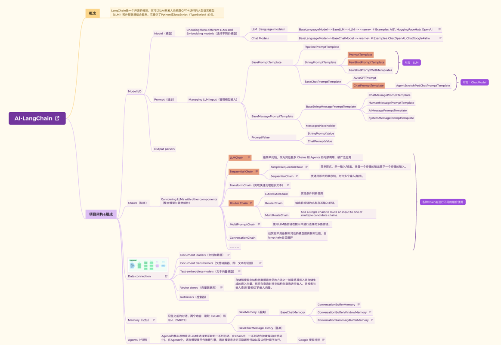
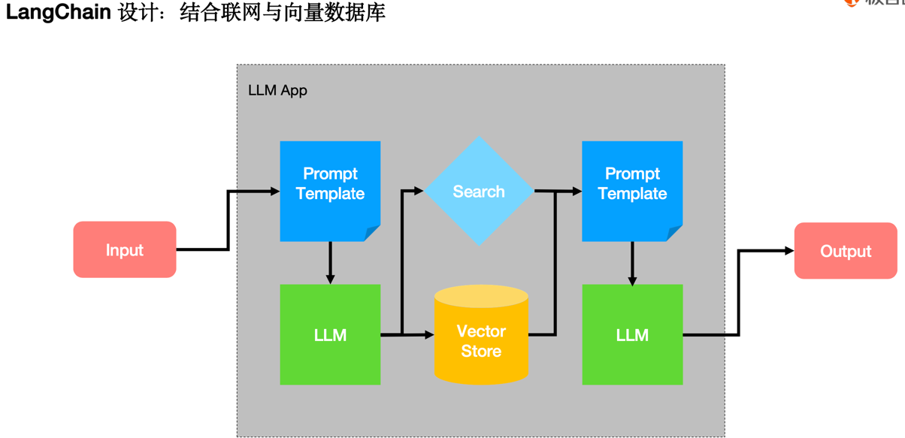

## 进阶篇：大模型应用开发框架-LangChain

### 第一部分：课后习题

<hr />

### 第二部分：相关名词解释

#### 1、LangChain是什么？为什么选择LangChain？

```text
1.LangChain是一个整合大语言模型的开发框架，类似于Flask是Python的后台服务开发框架。
2.他通过组合模块和能力抽象来扩展 LLM，使得用户不用直接与大语言模型对接，他帮我们封装好与大语言的模型交互的，使得用户可以更加轻松的使用模型进行开发。
比如：GPT-4很强了，但是无法联网、无法对接外部工具、不能调用第三方api等，langchain已经帮用户封装好了预留的接口，用户可以轻松上手
```


#### [2、怎么使用LangChain？经典案例](../project/langchain)
```python
import configparser

conf = configparser.ConfigParser()
conf.read("../config.ini")
chat_model = "gpt-3.5-turbo"
text_model = "text-davinci-003"
api_key = conf.get("Openai", "api_key")
```
```python
# 1.Completion对比
# 使用openai原生接口方式，调用ChatGPT的接口
import openai

prompt_str = 'You are a translation assistant'
openai.api_key = api_key
conversation = openai.Completion.create(
    model=text_model,
    prompt=prompt_str,
    max_tokens=100,
    temperature=0.2,
    stream=False
)
result_text = conversation["choices"][0]['text']
print(result_text)

# -----------------------------------------------------------------
# 使用langchain，调用ChatGPT的接口
from langchain.llms import OpenAI

llm = OpenAI(model_name=text_model, openai_api_key=api_key)
llm.max_tokens = 100
llm.temperature = 0.2
result_text = llm(prompt_str)
print(result_text)

```

```python

# 2.ChatCompletion
# 使用openai原生接口方式，调用ChatGPT的接口
prompt_system_str = "You are a translation assistant, and you name is Macy, a kindness young lady."
prompt_user_str = "Hi Macy! I am glad to see you."

conversation = openai.ChatCompletion.create(
    model=chat_model,
    messages=[
        {"role": "system", "content": prompt_system_str},
        {"role": "user", "content": prompt_user_str}],
    max_tokens=50,
    temperature=0.2,
    stream=True
)
for event in conversation:
    if event['choices'][0]['finish_reason'] != 'stop':
        print(event['choices'][0]['delta']['content'], end='')
        
# -----------------------------------------------------------------
# 使用langchain，调用ChatGPT的接口
from langchain.chat_models import ChatOpenAI
from langchain.schema import (HumanMessage, AIMessage, SystemMessage)

chat = ChatOpenAI(model_name=chat_model, openai_api_key=api_key)
chat.max_tokens = 100
chat.temperature = 0.2

conversation = chat([
    SystemMessage(content=prompt_system_str),
    HumanMessage(content=prompt_user_str)
])
print(conversation)
```
  

<hr />

#### [3、LangChain的架构（xmind格式）](../resource/AI-LangChain.xmind)
  

  

### 第三部分：一些问答

<hr />