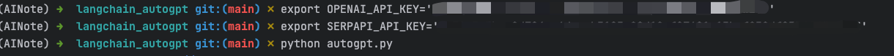
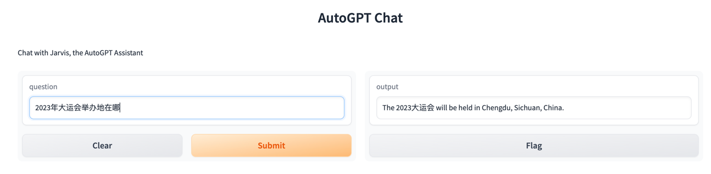
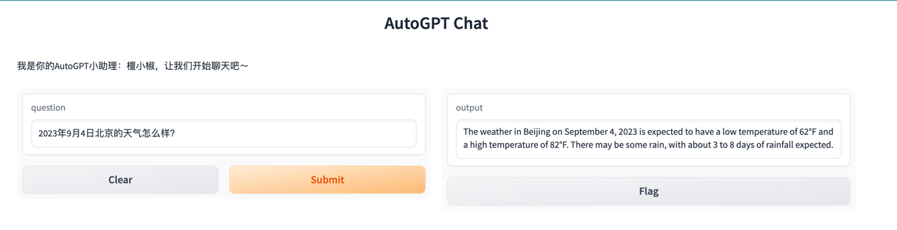

### 基于LangChain实现网红项目 AutoGPT
- 项目启动步骤：
```linux
cd AINote/project/langchain_autogpt
export OPENAI_API_KEY='openai apikey'
export SERPAPI_API_KEY='google search apikey'
python autogpt.py
```


- 查询结果展示



