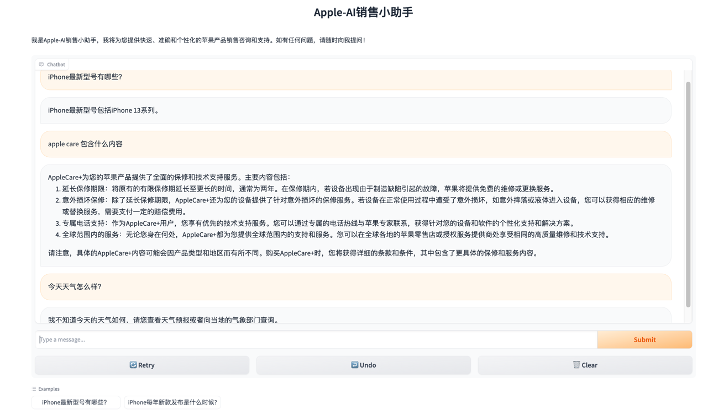
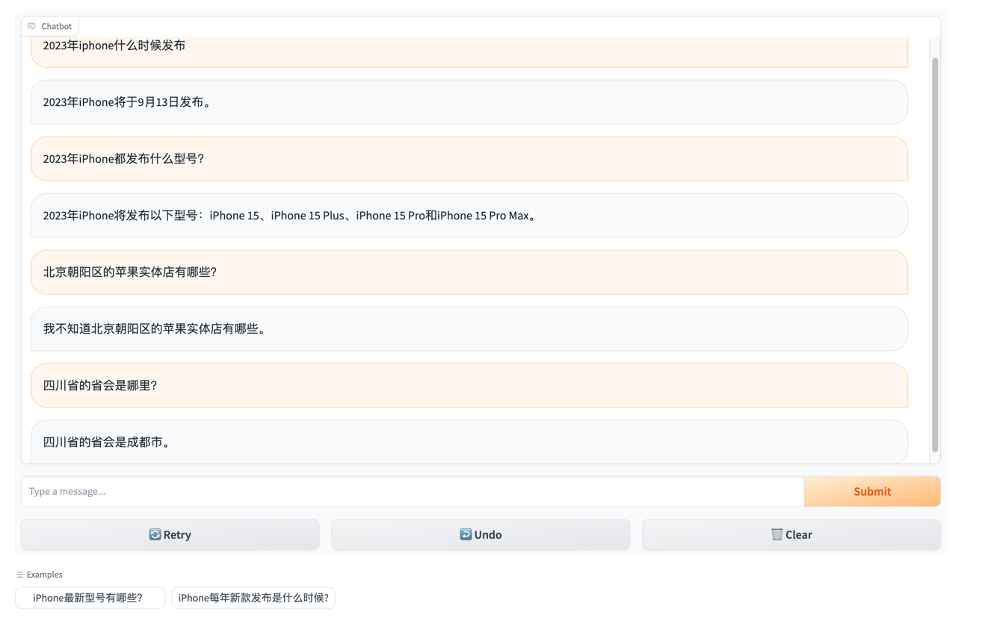
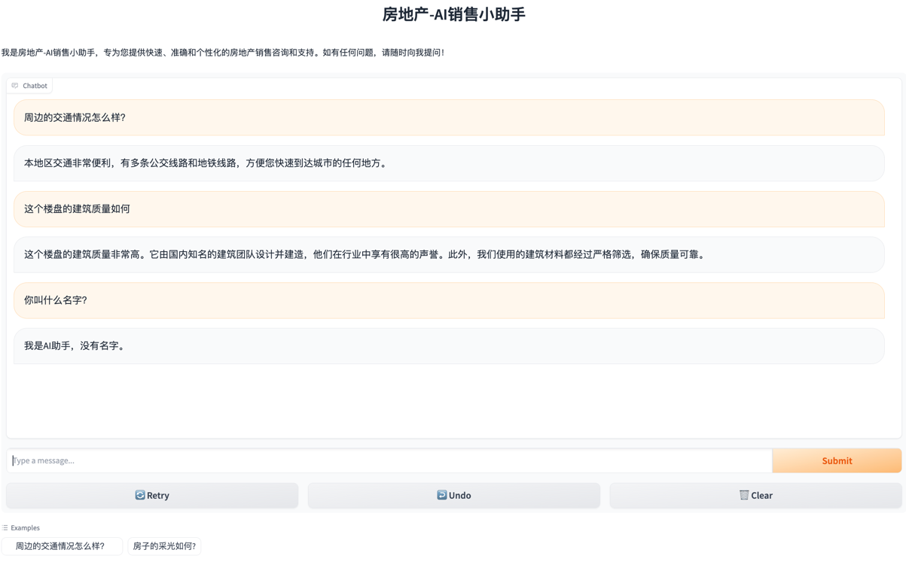

## 基于知识库的销售机器人

销售机器人是一个智能销售助手，旨在帮助您提供快速而准确的销售咨询和答案。该项目目前支持两个应用场景："房地产-AI销售小助手"
和"Apple-AI销售小助手"。

### 功能特点
- 支持多个AI模型：销售机器人具备灵活性，支持使用不同的AI模型。它可以与ChatGLM（TODO ing）和OpenAI等模型进行集成，以提供更多的选择和优化。

- 基于知识库的Q&A问答对：销售机器人使用向量数据库来存储和检索问题和答案的对应关系。通过对知识库中的问题和答案进行向量化，销售机器人能够快速地从数据库中检索相关的答案。

- Google 搜索对接：支持大模型调用google search API，https://serpapi.com

- 动态更新向量数据库Q&A问答对：销售机器人会将与本机器人相关性高的问答对存储到当前的向量数据库中，以便提高回答准确性和覆盖范围。这样，随着时间的推移，机器人将变得更加智能和适应性强。

- 图形用户界面(GUI)：为了更加便于使用，销售机器人实现了一个基于Gradio的图形用户界面。通过GUI，您可以轻松与机器人进行交互，提出问题并查看相应的答案。


### 如何使用

- 1.克隆仓库 `git clone git@github.com:ShengqinYang/AINote.git`
- 2.需要 Python 3.10 或更高版本。使用 `pip install -r requirements.txt` 安装依赖项。
- 3.设置您的 OpenAI API 密钥($OPENAI_API_KEY)、SERPAPI_API_KEY。您可以将其添加到环境变量中。
- 项目启动步骤：

```linux
cd AINote/project/langchain_sales_chatbot
export OPENAI_API_KEY='openai apikey'
export SERPAPI_API_KEY='serpapi_api_key'
python sales_chatbot.py
or
python sales_chatbot.py --title="房地产-AI销售小助手" --enable_chat=False

```

- 结果展示
  
  
  
  

### 贡献

如果您想为销售机器人项目做出贡献，欢迎提交问题报告、功能建议或者直接参与代码贡献。请参阅项目的贡献指南以获取更多信息。

### 联系方式

如果您对项目有任何疑问或建议，请随时通过以下方式与我们联系：

- 电子邮件：jean_open_main@163.com
  我们非常感谢您对销售机器人项目的支持和关注！感谢您的贡献！

请根据您的需求修改和补充该README示例，确保包含您的项目的具体信息和要点。
