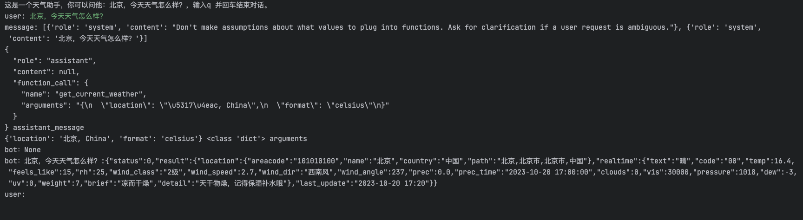

## 1、example_chat_completion.py 使用说明

本程序实现了一个简单的命令行聊天机器人，允许用户与机器人进行交互并记录对话历史。start_chat()
函数用于开始对话，用户可以输入消息进行交流，直到输入 "q" 结束对话。chat_with_bot(message) 函数用于与聊天机器人进行对话，调用
OpenAI 的 ChatCompletion API 生成机器人的回复。整个程序提供了基本的对话功能，可以根据用户的输入和机器人的回复形成对话历史，为交互提供了简单的聊天体验。

### `chat_with_bot(message)`函数说明

* 该函数用于与聊天机器人进行对话。根据传入的消息 message（以字典形式表示），函数调用了 OpenAI 的
  ChatCompletion API 进行对话生成，并返回机器人的回复。

* 参数：`message`（字典）：表示聊天对话的消息列表。每条消息都由 `{"role": "角色", "content": "内容"}` 格式的字典表示。`"角色"` 表示消息的发送者，可以是用户、系统或助手等，"内容" 表示消息的内容。

* 返回值：机器人的回复，以字典形式表示。字典包含两个键值对：`{"role": "角色", "content": "回复内容"}`。其中 `"角色"`
  表示机器人的角色，`"回复内容"` 表示机器人的回复内容。

#### 使用方法

* 构造一个消息列表 `message`，其中包含对话的初始消息，可以是系统消息或用户消息。

* 调用 `chat_with_bot(message)` 函数，并传入消息列表 `message`。

* 函数将根据传入的消息列表 `message` 调用 OpenAI 的 ChatCompletion API，并获取机器人的回复。

* 返回机器人的回复，以字典形式表示。

请注意，这是一个示例函数，实际使用时，需要根据 OpenAI ChatCompletion API 的具体接口和返回格式进行调整。同时，确保安全处理用户输入和返回的内容，避免潜在的安全问题。

### `start_chat()` 函数说明

* 运行 `start_chat()` 函数后，您可以开始与聊天机器人进行对话。

* 首次开始会话时，您需要定义一个角色并提供简单描述。输入完成后，该信息将被添加到对话消息列表中，并显示为系统消息。

* 后续每次会话时，程序将加载之前的对话内容到 `message` 列表中，以便您可以查看之前的对话历史。

* 输入任意消息以与机器人进行对话，当您输入 'q' 并回车时，对话将结束。

* 在对话过程中，您的输入将显示为用户消息，机器人的回复将显示为机器人消息。

请注意，这是一个示例函数，chat_with_bot() 函数的实现未在代码中给出，您需要根据实际情况自行定义并实现该函数。同时，确保安全处理用户输入和返回的内容，避免潜在的安全问题。

### 使用样例输出

# 2.example_chat_competion_use_weather_function.py
本程序实现了一个简单的命令行天气助手机器人，允许用户与机器人进行交互并记录对话历史。start_chat()
#### web url：https://www.apispace.com/
#### 需要注册登陆该网站并获取apikey，截止：2023-07-28日，该网站每一类接口，新用户有200次免费使用权限
#### 在config.ini中配置自己的apikey

祝您享受与聊天机器人的交互！
