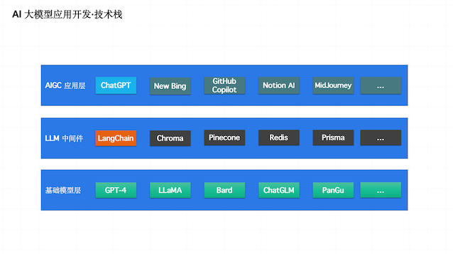

## 第一章：大模型基础--理论与技术的演进（第一节课）

### 第一部分：课后习题
```text
单项选择题：

注意力机制（Attention）的主要用途是什么？
A. 优化模型训练速度
B. 提高模型准确率
C. 选择重要的信息并忽略不相关的信息
D. 改进模型的可解释性
答：C

Transformer 模型是基于什么理论构建的？
A. 递归神经网络（RNN）
B. 卷积神经网络（CNN）
C. 注意力机制（Attention）
D. 自组织映射（SOM）
答：C

GPT 和 BERT 的主要区别是什么？
A. GPT 是基于 Transformer 的，而 BERT 不是
B. BERT 是基于 Transformer 的，而 GPT 不是
C. GPT 使用了单向自注意力，而 BERT 使用了双向自注意力
D. GPT 和 BERT 在基本结构上没有区别
答：C

在注意力机制中，“Q”、“K”和“V”分别代表什么？
A. 查询、密钥和值
B. 查询、键入和验证
C. 快速、关键和验证
D. 问题、知识和视觉
答：A

Transformer 模型是如何解决长距离依赖问题的？
A. 通过递归神经网络（RNN）
B. 通过卷积神经网络（CNN）
C. 通过注意力机制（Attention）
D. 通过自组织映射（SOM）
答：C

GPT 主要用于哪种类型的任务？
A. 分类任务
B. 回归任务
C. 生成任务
D. 聚类任务
答：C

以下哪项是 BERT 的主要创新之处？
A. 引入了自注意力机制
B. 使用了双向自注意力机制
C. 提出了新的优化算法
D. 突破了模型大小的限制
答：B

在 Transformer 模型中，自注意力机制的主要作用是什么？
A. 加速模型训练
B. 识别输入中的关键信息
C. 生成高质量的词嵌入
D. 提高模型的鲁棒性
答：B

基于 Transformer 的模型，如 GPT 和 BERT，主要适用于哪些任务？
A. 图像识别
B. 自然语言处理
C. 语音识别
D. 强化学习
答：B

注意力机制最早是在哪个领域得到应用的？
A. 计算机视觉
B. 语音识别
C. 自然语言处理
D. 推荐系统
答：C
```
```text
多项选择题：

以下哪些方法被用于处理序列数据？
A. 递归神经网络（RNN）
B. 卷积神经网络（CNN）
C. 注意力机制（Attention）
D. 支持向量机（SVM）
答：A、B、C
解释：
    递归神经网络（RNN）、卷积神经网络（CNN）和注意力机制（Attention）都被广泛应用于处理序列数据。具体来说：
    递归神经网络（RNN）：用于处理序列数据中的时序关系，能够通过循环单元对序列中的上下文信息进行建模，从而对序列中的每个元素进行处理。
    卷积神经网络（CNN）：主要应用于序列数据中的局部模式识别，可以有效地对时间序列或文本数据中的局部特征进行提取。
    注意力机制（Attention）：能够根据输入序列中不同位置的重要性进行加权处理，从而提取相关的特征信息，并在不同任务中取得了显著的效果。
    支持向量机（SVM）虽然也是一种常用的分类算法，但是主要用于处理结构化数据，而非序列数据。

以下哪些模型使用了注意力机制？
A. BERT
B. GPT
C. LeNet
D. ResNet
答：A、B
解释：
    BERT和GPT都使用了注意力机制来对输入序列进行编码和解码，从而实现自然语言处理任务，如文本分类、问答系统、文本生成等。
    LeNet和ResNet则是图像识别领域的经典模型，主要用于图像分类、目标检测等任务，并没有使用注意力机制。
    其中，LeNet是最早的卷积神经网络模型之一，ResNet是一种深度残差网络，它通过引入残差连接来训练更深的神经网络。

以下哪些模型主要用于自然语言处理任务？
A. GPT
B. BERT
C. VGG
D. LeNet
答：A、B
解释：
    GPT和BERT主要用于自然语言处理任务，如文本分类、问答系统、文本生成等。
    其中，GPT主要用于生成式自然语言处理任务，如文本生成、机器翻译、故事生成等；
    BERT则主要用于判别式自然语言处理任务，如文本分类、问答系统、命名实体识别等。
    VGG和LeNet则主要用于图像识别任务，其中，VGG是一种经典的卷积神经网络模型，主要用于图像分类任务；
    LeNet是最早的卷积神经网络模型之一，主要用于手写数字识别任务。

下列哪些说法正确描述了注意力机制的作用？
A. 它可以用来改进模型的训练速度
B. 它可以用来挑选出重要的信息并忽略不相关的信息
C. 它可以用来生成高质量的词嵌入
D. 它可以用来提高模型的鲁棒性
答：B
解释：
    注意力机制的主要作用是对输入序列中的不同位置信息进行加权，从而挑选出重要的信息并忽略不相关的信息。
    这种加权处理过程可以使模型更加关注重要的信息，从而提高模型的性能和表现。
    注意力机制并不是用来改进模型的训练速度的，它在某些情况下甚至可能会增加模型的计算复杂度。
    注意力机制也不是用来生成词嵌入的，它通常用于对序列进行编码和解码。
    注意力机制虽然可以提高模型的鲁棒性，但这并不是它的主要作用。

下列哪些说法正确描述了 BERT 模型？
A. BERT 模型是基于 Transformer 的
B. BERT 模型使用了双向自注意力机制
C. BERT 模型主要用于图像分类任务
D. BERT 模型突破了模型大小的限制
答：A、B
```



### 第二部分：相关名词解释
#### 1、LLM（Large Language Model）大语言模型是什么？
```text
LLM是Large Language Model的缩写，指的是大型语言模型。大型语言模型是一类基于深度学习技术的人工智能模型，利用海量的文本数据进行训练，可以学习到自然
语言的规律和模式，并且可以用于自然语言生成、理解、翻译、分类等多项自然语言处理任务。

当前的主流大型语言模型包括GPT-3、BERT、RoBERTa、T5、XLNet等，它们都是基于Transformer架构的预训练模型，在自然语言处理领域具有广泛的应用。这些模
型一般需要使用超级计算机和大规模的训练数据进行训练，因此需要大量的计算资源和时间成本。
```
#### 2、常见的大语言模型有什么？
```text
目前主流的大语言模型包括但不限于以下几种：
GPT-4（Generative Pre-trained Transformer 4）：由OpenAI开发的一种基于Transformer架构的预训练语言模型，具有非常强大的自然语言生成和理解能
力，能够执行多项自然语言处理任务。

BERT（Bidirectional Encoder Representations from Transformers）：由Google开发的一种基于Transformer架构的预训练语言模型，具有强大的双
向上下文理解能力，被广泛应用于文本分类、问答系统等任务。

RoBERTa（Robustly Optimized BERT Pretraining Approach）：由Facebook AI Research开发的一种基于BERT架构的预训练语言模型，采用更大规模
的数据和更长的训练时间进行训练，在多项自然语言处理任务上表现优异。

T5（Text-to-Text Transfer Transformer）：由Google Brain开发的一种基于Transformer架构的通用文本生成模型，可以执行多种自然语言处理任务，如
文本摘要、机器翻译、文本分类等。

XLNet（eXtreme MultiLingual Language Model）：由Carnegie Mellon University、Google Brain和其他机构联合开发的一种基于Transformer架
构的预训练语言模型，采用了一种新的预训练方法，可以在多项自然语言处理任务上取得优异的表现。

ChatGLM是一种基于GPT-3模型的对话生成模型，由OpenAI在2021年推出。ChatGLM是一种大规模语言模型，它可以通过对大量文本数据进行预训练，自动学习自然语
言的规律和模式，从而实现对话生成和自然语言处理任务。与传统的对话生成模型不同，ChatGLM是基于GPT-3模型构建的，在模型的设计和训练过程中，充分利用了GPT
-3模型的优势，如多层的Transformer编码器、大量的训练数据和自适应的学习能力等。ChatGLM模型可以生成自然流畅的对话，并且能够在多个领域和主题上进行对
话生成，包括通用对话、技术支持、医疗咨询等。

BARD（Building Automated Responses for Dialog）是由Facebook AI Research于2021年提出的一种自动化对话生成模型。与传统的对话生成模型不同，
BARD模型不需要依赖大量的对话数据进行训练，而是通过对话生成引擎和语言模型的结合，可以自动生成自然流畅的对话响应。BARD模型将对话生成看作一个基于模板的
文本生成问题，它通过对输入的对话文本进行解析和理解，从而自动构建出一个适用于该对话的模板，然后使用语言模型来自动生成对话响应。BARD模型的优点是在不需要
大量对话数据的情况下，可以快速生成高质量的对话响应。这使得BARD模型在对话系统、客服机器人等领域具有广泛的应用前景。
```

#### 3、Transformer是什么？
```text
Transformer是一种由Google开发的基于自注意力机制（self-attention）的神经网络架构，主要用于自然语言处理任务。相较于循环神经网络（RNN）和卷积神经
网络（CNN）等传统的序列模型，Transformer在处理长序列数据时具有更好的效果和更高的并行性。

Transformer的核心思想是自注意力机制，它允许模型在处理输入序列时对不同位置的信息进行加权处理。自注意力机制能够有效地捕捉输入序列中的上下文信息，从而提高模型的性能。
Transformer模型由编码器和解码器两部分组成，其中编码器用于将输入序列编码成隐含表示，而解码器则用于根据编码器的输出生成目标序列。
在Transformer中，Attention机制被广泛应用于编码器和解码器的各个层次，从而构建出一个强大的自注意力模型，可以在多项自然语言处理任务上取得优异的表现。
```
#### 4、RNN是什么？
```text
RNN指的是递归神经网络（Recurrent Neural Network），是一种用于处理序列数据的神经网络模型。
与传统的前馈神经网络不同，递归神经网络在处理序列数据时能够对序列中的上下文信息进行建模。它通过引入循环结构，将序列中的每个元素都看作一个时间步，将上一
时间步的输出作为当前时间步的输入，从而在序列中引入记忆机制。这使得递归神经网络可以对序列数据中的时序关系进行建模，从而在多个时间步中共享参数，减少了模
型的参数数量，也提高了模型的效率。
递归神经网络在自然语言处理、语音识别、机器翻译、图像描述等领域中得到了广泛的应用。然而，由于梯度消失和梯度爆炸等问题的存在，递归神经网络在处理长序列数
据时可能会出现性能不佳的情况。因此，后来的一些模型如LSTM和GRU等被提出来解决这些问题。
```
#### 5、注意力机制：Attention是什么？
```text
注意力机制（Attention）是一种用于加权处理序列数据中不同位置的信息的方法。在自然语言处理和计算机视觉等领域，注意力机制已成为许多成功模型的核心组件。
具体来说，注意力机制可以对输入序列中的每个位置进行加权处理，得到每个位置的权重，然后将加权后的结果进行求和，得到一个加权后的向量表示。
不同的注意力机制可以通过不同的方式计算权重，例如基于点积、加性、多头等方式。
```


### 第三部分：一些问答
##### 1、每次向 GPT 提问，回答注意力的权重都是不一样的吗？
```text
答：不一样，GPT自注意力模型，GPT在接受问题不同时，计算注意力权重的机制是不同的，回答时的注意力权重也不同。你问chatgpt相同问题，它不一定给你相同的回答。
```
##### 2、Transformer 中，如果 Encoder 和 Decoder 都是 Self-Attention ，那么如何处理问题和答案之间的关系？（通过 Mask 吗？）
```text
答：问题与答案之间的信息泄露？ 是通过mask技术，掩码让问题不能全部看到答案，答案不能全部看到问题，避免信息泄露。
```
##### 3、Encoder-Decoder Attention 是 Self-Attention 吗？
```text
答：不算是，这个今晚彭老师着重讲过。encoder-decoder attention从编码器中能关注到特定的位置，self-attention是模型内部的自注意力机制，可以关注到输入序列中的所有位置。
```
##### 4、Bert是基于编码器，GPT是基于解码器，不是编码和解码一块用吗？
```text
答：这3句话都没错，2个维度。 Bert和GPT的训练都用到了transformer，都用transformer的编码器和解码器来做预训练。但， Bert目的是捕捉上下文信息，它强化了编码器能力。GPT的目的是序列生成能力，它用自回归强化了解码器能力。
```
##### 5、到底应该怎么理解”参数“，几十亿的参数是什么概念，理解成收音机的旋转按钮？跟编程语言的函数参数可以类比吗？ 对应到Transformer中的什么地方
```text
答：简单点说，参数就是你可以调节的变量。 学术点说，参数是模型训练中可调节的变量和权重，函数中的权重参数，tansformer中的权重和偏置矩阵。 训练的目的，就是找到最佳的参数值。
```
##### 6、我讲讲个人朴素的理解，讲的不对请老师和大家指正，信息传递总是会受损的，编码解码过程也会受损，一个人要把自己大脑中的信息讲出来，要编码，信息就会受损，听到的人再在自己的大脑中解码也会受损，但是同对于一个事情，大家大脑中的思考是差不多的
```text
答：基本认同，LLM就是在理解语言本身，也即是表示（representation）学习的范畴。大语言模型初步解决了：跨语言同语义问题，同语言长距离（指代）问题等。
```

##### 7、当前gpt3.5的语义识别和bert哪个强，同样的语料（比如几万条）微调bert和gpt3.5的ada预训练模型哪个效果好？
```text
答：这两个侧重点不同，你关注在上下文信息或语义理解上，就选Bert；关注在任务生成上，就选GPT。侧重点不同。

问：比如企业中后台做一些运维操作，对产品的一些自然语言输入需要解析出操作的对象meta信息，然后作为参数调用api后，解析response最终做一个summary返回给用户。
是不是关注原始输入解析到meta调用api这一步，bert理论上会更有优势？
但实践中看，langchain调用gpt3.5利用 outputparser效果也不错，调整prompt后没看到多少解析不对的情况，然后应该可以调用agent调完api，结合问题，转到gpt优势领域生成回答了
所以是不是可以认为除了一些垂直领域如特定情感分析场景，力大砖飞的GPT可以把所有前辈扫到垃圾桶了？

答：是这样的，关注原始输入解析到meta信息 理论上bert具有优势 Bert可以学习到更加丰富的上下文信息和语义信息， Bert是有优势的。
但实际应用比较多样，垂直领域的应用场景具有特定的语言特征和结构，需要更精细的模型进行调整和优化，针对这种特定领域，langchain调用gpt3.5的精调，可能更具有优势。
不过，对于一些垂直领域，尤其是垂直的狭窄的有很多标注数据的，GPT大语言模型不一定就比其他有针对优化的模型效果更好。
还是要具体场景具体分析，不过对于应用场景，建议可以把longchain的GPT3.5当成baseline，现在用起来成本不高，而且这个baseline起点不低。
```

##### 8、我要做文本分类，text1已经通过llm找到了分类label1了，我将（text1，label1）缓存起来。我想输入侧的text2不经过llm和text1对比拿label，有什么方式吗？
```text
答：没太听懂，tex1->label1通过llm做了标注，然后text2不想通过llm了。 那是变成了text2 和tex1的关系来推label2?那你需要挖text2 和text1的关系，特征工程比如词袋模型？然后用传统的SVM机器学习？
```
##### 9、向量的比较有余弦相似度等等，这些是不需要经过llm的吧？现在市面上最主流的向量相似度比较方法是什么？
```text
答：嗯，不是所有的都需要经过llm的，虽然llm也可以解决。 余弦？欧几里得？曼哈顿？字符串的编辑距离？常用的是这些，应该还有其他的一些。
```


便易理解：
- 同学间互相传话（RNNs）
- 老师查小纸条（解码器Decoder）
- 老师叫来每个同学问话（注意力机制Attention）
- 你画我猜（Multi-head Attention）
- 向左看齐（BERT）
